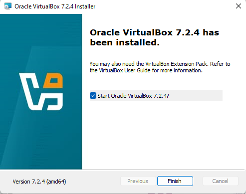
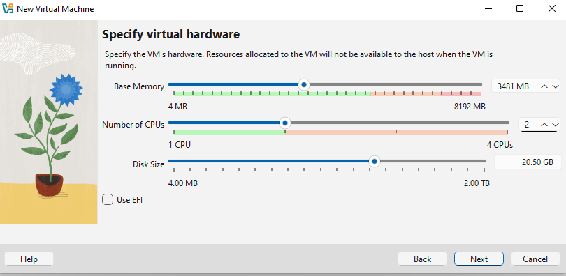
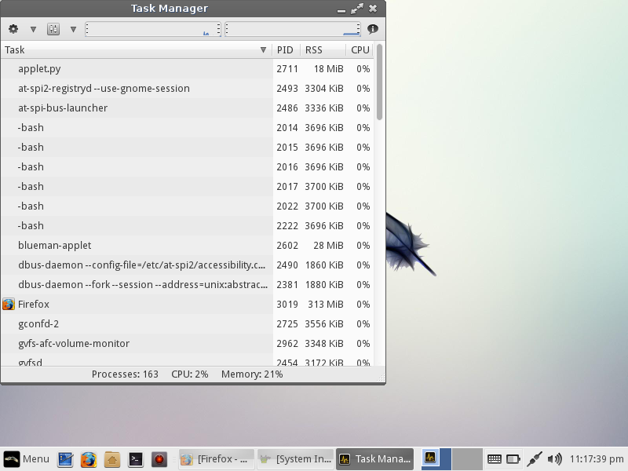

# Laporan Praktikum Minggu 12
Topik: Virtualisasi Menggunakan Virtual Machine  

---

## Identitas Kelompok
- **Nama**  : Awwab Maftuhi  
- **NIM**   : 250202920  
- **Kelas** : 1 IKRB

---

## Tujuan
Setelah menyelesaikan tugas ini, mahasiswa mampu:
1. Menginstal perangkat lunak virtualisasi (VirtualBox/VMware).  
2. Membuat dan menjalankan sistem operasi guest di dalam VM.  
3. Mengatur konfigurasi resource VM (CPU, RAM, storage).  
4. Menjelaskan mekanisme proteksi OS melalui virtualisasi.  
5. Menyusun laporan praktikum instalasi dan konfigurasi VM secara sistematis.


---

## Dasar Teori
Tuliskan ringkasan teori (3–5 poin) yang mendasari percobaan.

---

## Langkah Praktikum
- Virtualisasi dapat menggunakan **VirtualBox** atau **VMware**.  
- Sistem operasi guest bebas (Linux Ubuntu direkomendasikan).  
- Praktikum dapat dilakukan secara **kelompok kecil (2–3 orang)**.

```

Struktur folder (sesuaikan dengan template repo):

praktikum/week12-virtual-machine/
├─ code/
│  └─ catatan_konfigurasi.txt (opsional)
├─ screenshots/
│  ├─ instalasi_vm.png
│  ├─ konfigurasi_resource.png
│  └─ os_guest_running.png
└─ laporan.md

```

1. **Instalasi Virtual Machine**
   - Instal VirtualBox atau VMware pada komputer host.  
   - Pastikan fitur virtualisasi (VT-x / AMD-V) aktif di BIOS.

2. **Pembuatan OS Guest**
   - Buat VM baru dan pilih OS guest (misal: Ubuntu Linux).  
   - Atur resource awal:
     - CPU: 1–2 core  
     - RAM: 2–4 GB  
     - Storage: ≥ 20 GB

3. **Instalasi Sistem Operasi**
   - Jalankan proses instalasi OS guest sampai selesai.  
   - Pastikan OS guest dapat login dan berjalan normal.

4. **Konfigurasi Resource**
   - Ubah konfigurasi CPU dan RAM.  
   - Amati perbedaan performa sebelum dan sesudah perubahan resource.

5. **Analisis Proteksi OS**
   - Jelaskan bagaimana VM menyediakan isolasi antara host dan guest.  
   - Kaitkan dengan konsep *sandboxing* dan *hardening* OS.

6. **Dokumentasi**
   - Ambil screenshot setiap tahap penting.  
   - Simpan di folder `screenshots/`.

7. **Commit & Push**
   ```bash
   git add .
   git commit -m "Minggu 12 - Virtual Machine"
   git push origin main


---

---

## Analisis Pengerjaan Praktikum
1. **Instalasi Virtual Machine**
   
2. **Pembuatan OS Guest**
   
3. **Instalasi Sistem Operasi**
   
4. **Konfigurasi Resource**

a. 
> setelah saya membuka 70 lebih tab di fire fox,di sistem terpakai bebrapa persen seperti gambar di bawah


b. sesudah mengubah konfigurasi ke lebih rendah
dengan cpu 1 dan RAM 1 GB

sistem terpakai sebanyak seperti gambar berikut:

disini saya melakukan tab seperti di gambar atas.
5. 
- Mekanisme Isolasi (Host vs Guest)
VM menyediakan isolasi total melalui Hypervisor (VMM) dengan cara:
1. Abstraksi Hardware: Guest menganggap dirinya berjalan di hardware fisik, padahal hanya mengakses hardware virtual yang dikontrol penuh oleh Host.

2. Pemisahan Memori: Setiap VM memiliki blok memori terisolasi yang tidak bisa diakses oleh VM lain atau Host.

3. Ring Deprivileging: Guest OS dijalankan pada tingkat privilese rendah, sehingga instruksi sensitif harus melewati pemeriksaan Hypervisor sebelum dieksekusi ke CPU fisik.

- Kaitan dengan Sandboxing
VM adalah bentuk Sandboxing tingkat sistem.

   Fungsi: Jika malware menyerang Guest OS, dampaknya hanya terbatas di dalam "kotak" virtual tersebut.

   Keamanan: Menghindari kerusakan pada sistem utama (Host) karena semua perubahan data hanya terjadi pada file disk virtual.

- Kaitan dengan Hardening OS
Virtualisasi mempermudah Hardening (pemeriksaan dan penguatan sistem) melalui:

1. Attack Surface Reduction:
   
   Memisahkan layanan kritis ke VM yang berbeda sehingga jika satu layanan jebol, yang lain tetap aman.

2. Immutable Infrastructure:
   
   Menggunakan Snapshot untuk mengembalikan OS ke kondisi "bersih" dan aman secara instan jika terdeteksi adanya anomali atau serangan.


---

## Kesimpulan
- Isolasi Keamanan Total

   VM menciptakan batasan fisik yang tegas (melalui Hypervisor) antara host dan guest. Hal ini memungkinkan aktivitas berisiko tinggi dilakukan di dalam sandbox, sehingga kegagalan sistem atau serangan malware pada OS guest tidak akan merusak OS host.

- Efisiensi dan Hardening
   
   Virtualisasi memungkinkan penerapan konsep hardening secara efisien dengan memisahkan layanan ke beberapa VM berbeda. Jika satu sistem kompromi, dampak serangan dapat dilokalisir tanpa menghentikan seluruh operasional.

- Fleksibilitas Pengujian

   Fitur seperti snapshot memudahkan pemulihan sistem ke kondisi aman secara instan, yang sangat krusial untuk pengujian konfigurasi keamanan tanpa risiko kehilangan data permanen.

---

## Quiz
1. Apa perbedaan antara host OS dan guest OS?  

   **Jawaban:** 
   
   Host OS adalah sistem operasi utama yang berjalan langsung pada perangkat keras dan mengelola seluruh sumber daya komputer, sedangkan Guest OS adalah sistem operasi yang berjalan di dalam mesin virtual dan menggunakan sumber daya yang disediakan oleh Host OS.


2. Apa peran hypervisor dalam virtualisasi?  

   **Jawaban:** 

   Peran hypervisor dalam virtualisasi adalah sebagai pengelola dan penghubung antara hardware, host OS, dan guest OS, sehingga beberapa sistem operasi dapat berjalan secara bersamaan pada satu komputer fisik.Singkatnya
   hypervisor berfungsi untuk membuat, menjalankan, dan mengatur mesin virtual dengan membagi sumber daya hardware (CPU, RAM, storage) secara aman dan efisien kepada setiap guest OS, serta memastikan masing-masing berjalan terisolasi tanpa saling mengganggu.

3. Mengapa virtualisasi meningkatkan keamanan sistem?   

   **Jawaban:**

   virtualisasi meningkatkan keamanan sistem karena setiap sistem operasi dan aplikasi berjalan dalam lingkungan yang terisolasi.
   Jika terjadi serangan, virus, atau crash pada satu mesin virtual, tidak langsung memengaruhi sistem lain maupun host OS.
   Data dan aplikasi antar mesin virtual terpisah, sehingga mengurangi risiko kebocoran data.
   Virtualisasi memudahkan snapshot dan rollback, sehingga sistem bisa cepat dipulihkan jika terjadi masalah.
   Pengujian software berbahaya atau tidak stabil dapat dilakukan tanpa risiko merusak sistem utama

---

## Refleksi Diri
Tuliskan secara singkat:
- Apa bagian yang paling menantang minggu ini?  
> beratnya file iso yang akan di export.
- Bagaimana cara Anda mengatasinya?  
> Menggunakan linux lite yang notabenenya lebih ringan(hanya 700-an mb). 
---

**Credit:**  
_Template laporan praktikum Sistem Operasi (SO-202501) – Universitas Putra Bangsa_
