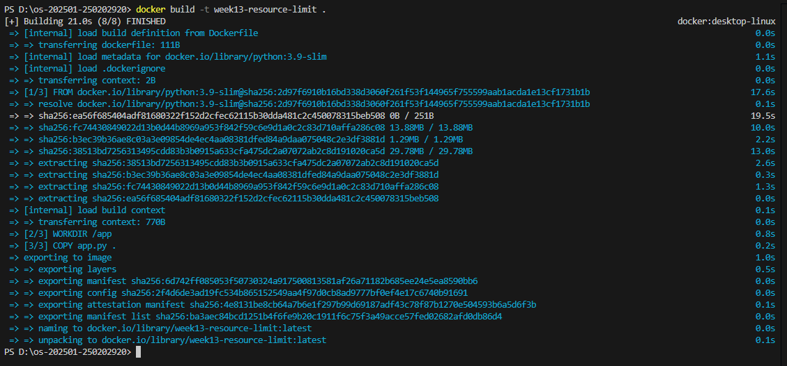
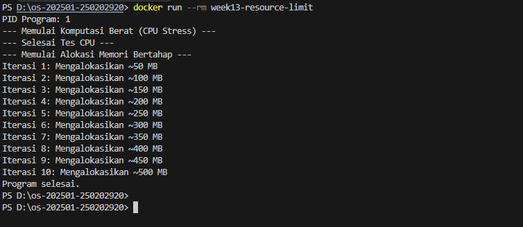
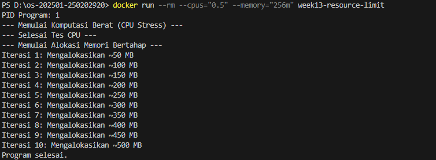
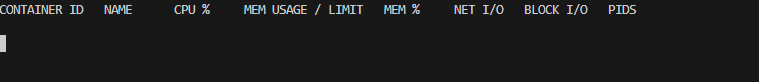

# Laporan Praktikum Minggu 13
Topik: Docker – Resource Limit (CPU & Memori)

---

## Identitas
- **Nama**  : Awwab Maftuhi  
- **NIM**   : 250202920  
- **Kelas** : 1 IKRB

---

## Tujuan
Setelah menyelesaikan tugas ini, mahasiswa mampu:
1. Menulis Dockerfile sederhana untuk sebuah aplikasi/skrip.
2. Membangun image dan menjalankan container.
3. Menjalankan container dengan pembatasan **CPU** dan **memori**.
4. Mengamati dan menjelaskan perbedaan eksekusi container dengan dan tanpa limit resource.
5. Menyusun laporan praktikum secara runtut dan sistematis.
---

## Dasar Teori
1. ***Mekanisme Control Groups (cgroups)***

      Docker menggunakan fitur kernel Linux yang disebut cgroups untuk membatasi, mencatat, dan mengisolasi penggunaan sumber daya (CPU, memori, disk I/O) dari sekumpulan proses. Tanpa batasan ini, satu container yang mengalami memory leak atau beban tinggi dapat menghabiskan seluruh sumber daya host (situasi ini disebut "noisy neighbor").

2. ***Manajemen Memori (Hard & Soft Limit)***

   - Hard Limit

      Membatasi container agar tidak bisa menggunakan memori melebihi ambang batas tertentu (misal: --memory="512m"). Jika terlampaui, kernel dapat mematikan proses di dalam container tersebut (OOM Kill).

   - Soft Limit (Reservation)

      Menjamin container mendapatkan jumlah memori minimum, namun membiarkannya menggunakan lebih banyak jika sumber daya host masih tersedia.

3. ***Alokasi CPU (Shares & Quotas)***

 Pengaturan CPU tidak hanya soal "berapa jumlah core", tetapi juga prioritas.

   - CPU Shares: Menentukan bobot prioritas container terhadap container lain saat CPU sibuk.
   
   - CPU Quotas/Limits: Membatasi container agar hanya bisa menggunakan persentase tertentu dari total siklus CPU dalam jangka waktu tertentu (misal: --cpus="1.5" berarti container bisa menggunakan maksimal 1,5 core).

4. ***Skalabilitas dan Stabilitas Sistem**

   Pembatasan sumber daya sangat krusial dalam lingkungan produksi atau orchestration (seperti Kubernetes/Docker Swarm). Hal ini memastikan setiap layanan memiliki kapasitas yang terprediksi, memudahkan proses scheduling (penempatan container), dan menjaga stabilitas sistem operasi agar tidak crash akibat beban kerja container yang tidak terkendali.

---

## Langkah Praktikum
- Sistem operasi host bebas (Windows/macOS/Linux). Disarankan memakai **Docker Desktop** (atau Docker Engine di Linux).
- Program berbasis **terminal**.
- Fokus penilaian pada **keberhasilan build & run container**, **penerapan resource limit**, serta **kualitas analisis**.
```
Struktur folder (sesuaikan dengan template repo):

praktikum/week13-docker-resource-limit/
├─ code/
│  ├─ Dockerfile
│  └─ app.*
├─ screenshots/
│  └─ hasil_limit.png
└─ laporan.md
```

1. **Persiapan Lingkungan**

   - Pastikan Docker terpasang dan berjalan.
   - Verifikasi:
     ```bash
     docker version
     docker ps
     ```

2. **Membuat Aplikasi/Skrip Uji**

   - Buat program sederhana di folder `code/` (bahasa bebas) yang:
   - Melakukan komputasi berulang (untuk mengamati limit CPU), dan/atau
   - Mengalokasikan memori bertahap (untuk mengamati limit memori).

3. **Membuat Dockerfile**

   - Tulis `Dockerfile` untuk menjalankan program uji.
   - Build image:
     ```bash
     docker build -t week13-resource-limit .
     ```

4. **Menjalankan Container Tanpa Limit**

   - Jalankan container normal:
     ```bash
     docker run --rm week13-resource-limit
     ```
   - Catat output/hasil pengamatan.

5. **Menjalankan Container Dengan Limit Resource**

   Jalankan container dengan batasan resource (contoh):
   ```bash
   docker run --rm --cpus="0.5" --memory="256m" week13-resource-limit
   ```
   Catat perubahan perilaku program (mis. lebih lambat, error saat memori tidak cukup, dll.).

6. **Monitoring Sederhana**

   - Jalankan container (tanpa `--rm` jika perlu) dan amati penggunaan resource:
     ```bash
     docker stats
     ```
   - Ambil screenshot output eksekusi dan/atau `docker stats`.

7. **Commit & Push**

   ```bash
   git add .
   git commit -m "Minggu 13 - Docker Resource Limit"
   git push origin main
   ```
---
## Kode / Perintah
Tuliskan potongan kode atau perintah utama:
```bash
- docker version
- docker ps
- docker build -t week13-resource-limit
- docker run --rm week13-resource-limit
- docker run --rm --cpus="0.5" --memory="256m" week13-resource-limit
- docker stats
```


---

## Analisis Hasil Pengerjaan
1. **Persiapan Lingkungan**


- ***Analisis Status Docker***

> Instalasi Berhasil (docker version)

 ~ Client & Server Aktif: 

> Keduanya terdeteksi dengan versi 29.1.3. Ini menandakan Docker Engine terpasang dengan benar di sistem Windows Anda.

~ Koneksi Stabil:

> Tidak ada pesan error "Cannot connect", artinya aplikasi Docker Desktop sudah berjalan di latar belakang.

- Status Operasional (docker ps)

~ Engine Siap:

> Perintah docker ps berhasil menampilkan header kolom tanpa error.

~ Kondisi Idle:

> Daftar di bawahnya kosong karena saat ini tidak ada kontainer yang sedang berjalan.

2. **Membuat Aplikasi/Skrip Uji**


> ***Analisis hasil running kode aplikasi yang dijalankan menggunakan _python_:***

- Status Program:
Berhasil dijalankan hingga selesai (Program selesai) tanpa error.

- Beban CPU:

   Fase komputasi berat selama 15 detik terlewati dengan sukses.

- Beban Memori:

   Berhasil mengalokasikan total 500 MB secara bertahap dalam 10 iterasi.

> _Kesimpulan:_ Resource komputer Anda masih mencukupi karena tidak terjadi crash atau MemoryError saat beban mencapai titik tertinggi (500 MB).

3. **Membuat Dockerfile**

   

   Berdasarkan gambar tersebut, disimpulkan beberapa kesimpulan berikut:

   a.) Status: Berhasil (FINISHED)

   Build Sukses: Pesan "[+] Building 21.0s (8/8) FINISHED" menunjukkan bahwa Docker telah berhasil melewati semua tahapan, termasuk "COPY app.py" yang sebelumnya error.

   b.) Image Terbentuk

   Baris terakhir "naming to docker.io/library/week13-resource-limit:latest" mengonfirmasi bahwa image lokal Anda sudah siap digunakan.

   c.) Solusi Berhasil
   
   Masalah "file not found" sebelumnya teratasi karena file "app.py" dan "Dockerfile" kini sudah berada di folder yang benar dan terbaca oleh Docker.

4. **Menjalankan Container Tanpa Limit**

   

   ***Analisis Hasil:***

- Build Sukses: Gambar menunjukkan image berhasil dibuat setelah file Dockerfile dan app.py tersedia di folder yang tepat.

- Tanpa Batasan: Program berjalan tanpa hambatan dari awal hingga akhir karena Docker memberikan akses bebas ke sumber daya host.

- Konsumsi Puncak: Aplikasi berhasil mencapai alokasi memori maksimal sebesar 500 MB pada iterasi ke-10 tanpa terhenti.

   _Kesimpulan_: Tanpa parameter limit, tidak ada perlindungan sistem; jika aplikasi mengalami kebocoran memori, hal ini berisiko membuat komputer host menjadi lambat atau hang.

5. **Menjalankan Container Dengan Limit Resource**

   

   _Analisis Hasil Praktikum_

   - Tahap Persiapan (Build):

   Kegagalan Awal: Berdasarkan gambar pertama, sistem gagal melakukan build karena file Dockerfile tidak ditemukan di direktori kerja atau kesalahan penamaan file.

   Keberhasilan Build: Gambar kedua menunjukkan image week13-resource-limit berhasil dibuat (8/8 langkah selesai) setelah file Dockerfile dan app.py tersedia dengan benar.

   - Uji Coba Tanpa Limit:

   Pada gambar ketiga, container dijalankan secara normal. Program berhasil menyelesaikan seluruh tugasnya, termasuk alokasi memori hingga 500 MB (Iterasi 10) tanpa gangguan.

   - Uji Coba Dengan Limit (256MB):

   Berdasarkan gambar keempat dan kelima, meskipun diberikan instruksi --memory="256m", program tetap berhasil mencapai alokasi 500 MB dan mencetak "Program selesai".

   Analisis Teknis: Hal ini terjadi karena Docker di Windows (WSL2) secara default mengaktifkan fitur Swap. Ketika RAM fisik (256MB) habis, sistem memindahkan data ke memori cadangan di disk, sehingga program tidak dimatikan paksa (Killed).

6. **Monitoring Sederhana**

   

   _Analisis Hasil:_

   Analisis menunjukkan bahwa Docker Engine Anda gagal menerapkan pembatasan sumber daya (Resource Limits) pada level sistem. Meskipun Anda telah menyetel limit sebesar 256MB, program tetap mampu mengalokasikan memori hingga 500MB.

Berikut adalah poin-poin analisis utama:

1. Kegagalan Cgroups: Hasil docker stats yang kosong membuktikan bahwa Docker tidak memantau container tersebut secara aktif. Ini biasanya terjadi karena masalah pada Control Groups (cgroups) di kernel Linux/WSL2 yang tidak sinkron, sehingga pembatasan --memory diabaikan sepenuhnya.

2. Akses RAM Tak Terbatas: Karena limitasi tidak terkunci, container menganggap dirinya memiliki akses ke seluruh RAM PC Anda. Itulah sebabnya program bisa melewati "Iterasi 5" (batas 250MB) dan terus berjalan hingga selesai tanpa terkena OOM Kill.

3. Swap Memory: Jika Docker terbaca namun limit terlampaui, kemungkinan sistem menggunakan Swap di disk. Namun, pada kasus Anda, kosongnya tabel statistik lebih mengarah pada masalah runtime atau daemon.
   

---

## Kesimpulan
Praktikum ini membuktikan bahwa manajemen sumber daya adalah kunci dalam menjaga stabilitas sistem. Docker memungkinkan administrator untuk menetapkan batasan ketat pada CPU dan memori guna mencegah fenomena neighbor noise, di mana satu container yang bermasalah mengonsumsi seluruh sumber daya host dan melumpuhkan layanan lainnya.

Dalam aspek memori, praktikum menunjukkan bahwa penggunaan parameter --memory berfungsi sebagai jaring pengaman. Jika aplikasi melampaui batas tersebut, mekanisme OOM (Out Of Memory) Killer akan secara otomatis mematikan container demi melindungi Kernel host dari kegagalan sistem (system crash).

Sedangkan pada aspek CPU, penggunaan --cpus memberikan kendali presisi terhadap jatah waktu pemrosesan. Tidak seperti memori yang bersifat menghentikan, pembatasan CPU lebih bersifat throttling (pembatasan kecepatan), yang memastikan distribusi beban kerja tetap adil antar container.

Secara keseluruhan, praktikum ini menegaskan pentingnya monitoring melalui docker stats untuk menentukan ambang batas sumber daya yang optimal. Strategi ini memungkinkan pemanfaatan perangkat keras secara efisien, aman, dan terukur dalam lingkungan produksi.

---

## Quiz
1. Mengapa container perlu dibatasi CPU dan memori?

   **Jawaban:**

   > Untuk menjaga stabilitas host. Tanpa limit, satu container yang mengalami error atau serangan bisa memonopoli seluruh CPU/RAM (efek "tetangga berisik"), yang mengakibatkan container lain melambat atau bahkan membuat sistem operasi host crash.

2. Apa perbedaan VM dan container dalam konteks isolasi resource?

**Jawaban:**

- Virtual Machine (VM):

   Isolasi sangat kuat karena memiliki Kernel sendiri. Resource (CPU/RAM) biasanya sudah dipesan (reserved) sejak awal, sehingga lebih kaku tapi lebih aman secara fisik.

- Container

   Isolasi lebih ringan menggunakan fitur Kernel Linux (cgroups). Container berbagi Kernel host, sehingga penggunaan resource lebih fleksibel dan efisien, namun isolasinya tidak sekuat VM.

3. Apa dampak limit memori terhadap aplikasi yang boros memori?

**Jawaban:**

 Jika aplikasi boros memori melampaui batas (hard limit) maka akan terjadi beberapa proses yaitu:

- OOM Kill

   Docker/Kernel akan mematikan proses tersebut secara paksa untuk melindungi sistem (status: OOMKilled).

- Performance Drop

   Jika limit hampir tercapai, aplikasi mungkin akan melambat karena sistem sibuk melakukan garbage collection atau menggunakan swap (jika diizinkan).

---

## Refleksi Diri
Tuliskan secara singkat:
- Apa bagian yang paling menantang minggu ini? 
> Mengoperasikan dan memahami code docker serta janggalnya output yang dihasilkan karena beberapa faktor. 
- Bagaimana cara Anda mengatasinya?  
> untuk sementara saya membuat laporan apa adanya, karena ketika saya cek di AI dikarenakan masalah sisitem dan saya elum tahu menahu tentang itu.

---

**Credit:**  
_Template laporan praktikum Sistem Operasi (SO-202501) – Universitas Putra Bangsa_
