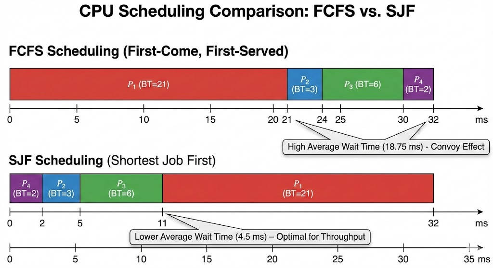

# Laporan Praktikum Minggu 14
Topik: Penyusunan Laporan Praktikum Format IMRAD
---

## Identitas
- **Nama**  : Awwab Maftuhi
- **NIM**   : 250202920
- **Kelas** : 1 IKRB

---

## Tujuan
Setelah menyelesaikan tugas ini, mahasiswa mampu:
1. Menyusun laporan praktikum dengan struktur ilmiah (Pendahuluan–Metode–Hasil–Pembahasan–Kesimpulan).
2. Menyajikan hasil uji dalam bentuk tabel dan/atau grafik yang jelas.
3. Menuliskan analisis hasil dengan argumentasi yang logis.
4. Menyusun sitasi dan daftar pustaka dengan format yang konsisten.
5. Mengunggah draft laporan ke repositori dengan rapi dan tepat waktu.

---
---
# Judul Laporan : Analisis Performa Algoritma Penjadwalan CPU (FCFS vs SJF)

---

## 1. Pendahuluan (Introduction)

### Latar Belakang
Penjadwalan CPU merupakan fungsi dasar dari sistem operasi modern yang memungkinkan multiprogramming. Efisiensi sistem sangat bergantung pada bagaimana algoritma penjadwalan mengelola antrean proses di *Ready Queue*. Dua algoritma yang sering dipelajari adalah **First-Come, First-Served (FCFS)** dan **Shortest Job First (SJF)**. 

FCFS bersifat non-preemptive dan sangat sederhana, namun sering kali menyebabkan *Convoy Effect*. Di sisi lain, SJF secara teoritis dianggap optimal untuk meminimalkan rata-rata waktu tunggu (*Average Waiting Time*). Laporan ini akan menguji kedua teori tersebut melalui simulasi data.

### Rumusan Masalah dan Tujuan
* **Masalah:** Bagaimana perbedaan signifikan antara FCFS dan SJF dalam menangani proses dengan *Burst Time* yang bervariasi?
* **Tujuan:** Menghitung dan membandingkan *Waiting Time* (WT) serta *Turnaround Time* (TAT) dari kedua algoritma untuk menentukan tingkat efisiensi masing-masing.

---

## 2. Metode (Methods)

### Lingkungan Uji
Eksperimen dilakukan menggunakan perhitungan manual yang divalidasi dengan simulator penjadwalan CPU berbasis web/Spreadsheet pada sistem operasi Windows 11.

### Parameter dan Dataset
Untuk menjaga objektivitas, digunakan dataset dengan *Arrival Time* (waktu kedatangan) yang sama ($AT = 0$) untuk semua proses.
* **Dataset:** 4 Proses ($P_1, P_2, P_3, P_4$).
* **Burst Time (BT):** * $P_1 = 21$ ms
    * $P_2 = 3$ ms
    * $P_3 = 6$ ms
    * $P_4 = 2$ ms

### Cara Pengukuran
1. **Waktu Tunggu ($WT$):** Dihitung dari selisih waktu mulai eksekusi dikurangi waktu kedatangan.
2. **Turnaround Time ($TAT$):** Dihitung dengan rumus $TAT = WT + BT$.
3. **Rata-rata ($Average$):** Total nilai dibagi dengan jumlah proses ($n=4$).

---

## 3. Hasil (Results)

Berikut adalah hasil perbandingan performa antara algoritma FCFS dan SJF berdasarkan dataset yang digunakan.

**Tabel 1: Hasil Pengujian Algoritma FCFS**

| Proses | Burst Time (ms) | Waiting Time (ms) | Turnaround Time (ms) |
| :--- | :---: | :---: | :---: |
| P1 | 21 | 0 | 21 |
| P2 | 3 | 21 | 24 |
| P3 | 6 | 24 | 30 |
| P4 | 2 | 30 | 32 |
| **Rata-rata** | **8.0** | **18.75** | **26.75** |

**Tabel 2: Hasil Pengujian Algoritma SJF (Non-Preemptive)**

| Proses | Burst Time (ms) | Waiting Time (ms) | Turnaround Time (ms) |
| :--- | :---: | :---: | :---: |
| $P_4$ | 2 | 0 | 2 |
| $P_2$ | 3 | 2 | 5 |
| $P_3$ | 6 | 5 | 11 |
| $P_1$ | 21 | 11 | 32 |
| **Rata-rata** | **8.0** | **4.5** | **12.5** |

### Grafik Perbandingan (Gantt Chart)

*Gambar 1: Visualisasi urutan eksekusi proses (Gantt Chart). Sumbu horizontal menunjukkan deret waktu dalam milidetik. Pada FCFS, proses berjalan sesuai urutan $P_1$ ke $P_4$, sedangkan SJF mengurutkan dari beban terkecil ke terbesar.*

---

## 4. Pembahasan (Discussion)

### Interpretasi Hasil
Data menunjukkan perbedaan yang drastis pada rata-rata waktu tunggu (*Average Waiting Time*). 
* Algoritma **FCFS** menghasilkan $AWT$ sebesar **18.75 ms**. Hal ini disebabkan oleh $P_1$ (proses terpanjang) yang dieksekusi pertama kali, sehingga proses-proses kecil lainnya harus menunggu sangat lama. Fenomena ini disebut **Convoy Effect**.
* Algoritma **SJF** berhasil menekan $AWT$ hingga menjadi **4.5 ms**. Dengan mendahulukan proses terpendek ($P_4$ dan $P_2$), sistem memberikan respon yang lebih cepat secara keseluruhan.

### Keterbatasan dan Perbandingan Teori
Hasil ini sesuai dengan teori yang menyatakan bahwa SJF memberikan rata-rata waktu tunggu minimum. Namun, dalam implementasi nyata, SJF memiliki keterbatasan yaitu sulitnya memprediksi nilai *Burst Time* proses berikutnya secara akurat sebelum dieksekusi. Selain itu, SJF berisiko menyebabkan *starvation* (kelaparan sumber daya) bagi proses dengan *Burst Time* sangat besar jika proses kecil terus-menerus datang.

---

## Daftar Pustaka
1. Silberschatz, A., Galvin, P. B., & Gagne, G. (2018). *Operating System Concepts* (10th ed.). Wiley.
2. Tanenbaum, A. S., & Bos, H. (2014). *Modern Operating Systems* (4th ed.). Pearson Education.

---

## Kesimpulan
1. **Efisiensi:** SJF terbukti jauh lebih efisien dalam meminimalkan waktu tunggu dibandingkan FCFS (penurunan $AWT$ dari 18.75 ms menjadi 4.5 ms).
2. **Karakteristik:** FCFS sangat dipengaruhi oleh urutan kedatangan, sedangkan SJF dipengaruhi oleh beban kerja proses.
3. **Rekomendasi:** SJF cocok digunakan pada sistem batch yang mengutamakan throughput, namun perlu mekanisme tambahan untuk menghindari starvation pada proses besar.

## Quiz ##

1. Mengapa format IMRAD membantu membuat laporan praktikum lebih ilmiah dan mudah dievaluasi?

   **Jawaban:**

   Format *IMRAD* (*Introduction, Methods, Results, and Discussion*) menyediakan kerangka kerja yang sistematis. Hal ini memudahkan evaluasi karena struktur yang konsisten memungkinkan pembaca menemukan informasi dengan cepat dan memastikan semua aspek penting dari eksperimen (tujuan, cara, hasil, dan interpretasi) terdokumentasi dengan jelas.

2. Apa perbedaan antara bagian *Hasil* dan *Pembahasan*?

   **Jawaban:**
   - *Hasil:* Berisi penyajian data murni (tabel, grafik) tanpa interpretasi. Fokus pada fakta "apa yang terjadi".

   - *Pembahasan:* Berisi analisis data, perbandingan dengan teori, penjelasan mengenai error, dan jawaban atas hipotesis. Fokus pada "mengapa itu terjadi".

3. Mengapa format IMRAD membantu membuat laporan praktikum lebih ilmiah dan mudah dievaluasi?

   **Jawaban:**

   Penting untuk menjaga integritas akademik, menghindari plagiarisme, memberikan penghargaan pada peneliti sebelumnya, dan memperkuat argumen dalam laporan dengan dasar teori yang valid.